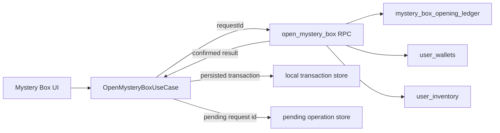

# Cloud Mystery Box Opening

## Overview

This phase moves Mystery Box opening from local RNG and local reward granting to a server-authoritative flow backed by Supabase.

The client still owns the opening animation, but it no longer chooses the prize.

## Architecture

- `OpenMysteryBoxUseCase` decides whether the cloud path is enabled.
- `CloudMysteryBoxOpeningRepository` is the only place that talks to Supabase.
- `SupabaseCloudMysteryBoxOpeningRepository` calls the `open_mystery_box` RPC.
- `RemoteMysteryBoxOpeningResultDto` turns the RPC payload into a typed transaction.
- `PendingMysteryBoxOperationStore` keeps a per-user pending `requestId` on disk.
- `LocalMysteryBoxOpeningRepository` persists confirmed transactions for presentation recovery.

## Source Of Truth

- Canonical prize selection happens in Supabase.
- The local client does not roll the reward.
- The local client does not send probabilities or arbitrary reward quantities.
- `public.user_wallets` is the authoritative wallet source.
- `public.user_inventory` is the authoritative inventory source for utility and cosmetic rewards.
- XP rewards are still surfaced in the confirmed result and are applied locally after confirmation, because XP is not part of the wallet.

## Reward Model

The proposed SQL catalog is versioned by `catalog_version` and stores:

- `reward_id`
- `reward_type`
- `quantity`
- `weight`
- `rarity`
- `is_active`
- `max_quantity`

Version 1 is seeded from the current in-app catalog:

- coin rewards
- XP rewards
- utility rewards

Cosmetic rewards are supported only if they already exist in the migrated catalog and are eligible in `public.shop_items`.

## RPC Contract

`open_mystery_box(p_request_id text)`:

- Uses `auth.uid()`.
- Validates the request id.
- Locks the user inventory row for the Mystery Box.
- Picks a reward on the server.
- Updates `user_wallets` and/or `user_inventory` atomically.
- Persists the selected reward and resulting balances in a ledger row.
- Returns the same result again for the same `requestId`.

## Cache And Session Behavior

- Pending request ids are stored per user.
- Confirmed transactions are stored per user.
- A cached confirmed transaction is reused after app restart.
- The pending store survives app restarts and keeps the same `requestId` for retries.
- Session changes are isolated by the active user scope.
- Logout should clear in-memory state, while persisted per-user caches remain on disk.

## States

The cloud opening flow can surface:

- `loading`
- `ready`
- `stale`
- `syncing`
- `walletMissing`
- `unauthenticated`
- `failed`

For the opening operation itself, the main statuses are:

- `success`
- `noBoxes`
- `timeout`
- `networkUnavailable`
- `malformedResponse`
- `requestConflict`
- `duplicateTransaction`
- `persistenceError`

## Feature Flag

- `CLOUD_MYSTERY_BOX_ENABLED`
- Default: `false`

When the flag is off, the legacy local opening path remains active.

## Proposed Migration

The migration added in this branch creates:

- `public.mystery_box_reward_catalog`
- `public.mystery_box_opening_ledger`
- `public.open_mystery_box(p_request_id text)`

The migration is versioned and idempotent, and it does not need a remote push from Flutter.

## Risks

- XP is still updated locally after the confirmed server result.
- The cloud open flow does not yet migrate cosmetics if the catalog contains rewards that are not already eligible.
- The client still refreshes visible shop economy after a successful open to keep UI in sync, so a stale read snapshot can temporarily delay visual updates.

## Next Phase

- Move XP reward application to a server-authoritative flow if needed.
- Expand the reward catalog with new versions instead of editing version 1 in place.
- Add recovery UX for confirmed-but-not-yet-presented results if the app is closed mid-animation.
